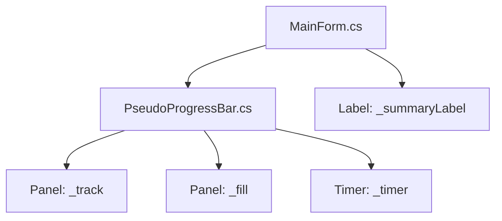

-----

# Design Document

## Overview

`MainForm.cs` に内蔵されている疑似プログレスバーを、独立した WinForms コンポーネント `PseudoProgressBar` として抽出する。このコンポーネントは、進捗バーの表示・非表示、進捗値の更新、疑似進捗アニメーションの管理を単一クラスに集約し、`MainForm` から進捗関連の複雑な状態管理を分離する。

## Steering Document Alignment

### Technical Standards (tech.md)

- **C# / WinForms**: `System.Windows.Forms` の `Panel`, `Timer` を利用して実装する
- **単一スレッド UI**: 進捗の更新は UI スレッド上で行い、`InvokeRequired` で安全にディスパッチする
- **既存パターンの維持**: `MainForm` と同じスタイル（青いバー、固定3Dのトラック）をコンポーネント側で維持する

### Project Structure (structure.md)

- 新規ファイル: `PseudoProgressBar.cs`（コンポーネント本体）
- 変更ファイル: `MainForm.cs`（進捗関連のフィールドとメソッドを削除し、コンポーネントを呼ぶ形に変更）



## Components and Interfaces

### Component 1: PseudoProgressBar

- **Purpose:** 進捗バーの表示・非表示、進捗値の更新、疑似進捗アニメーションの管理
- **Interfaces:**
  - `Start(int current, int total)`: 進捗表示を開始し、バーを表示する。進捗値と target を設定する
  - `Update(int current, int total)`: 進捗値と target を更新し、バーの幅を計算する
  - `SetVisible(bool visible)`: 進捗バーの表示・非表示を切り替える
  - `HideProgress()`: 進捗バーを非表示にし、タイマーを停止する
  - `Reset()`: 進捗値を 0 にリセットする
- **Dependencies:** `System.Windows.Forms.Timer`, `System.Windows.Forms.Panel`
- **Reuses:** `MainForm` と同じ進捗表示のスタイル（色、サイズ、ボーダー）

### Component 2: MainForm（進捗関連の依存を解消）

- **Purpose:** UI の構成と操作のオーケストレーション。進捗表示の詳細は `PseudoProgressBar` に委譲する
- **Interfaces:**
  - `MainForm` は `PseudoProgressBar` をフィールドとして保持し、進捗関連の操作はすべてこのコンポーネントを介して行う
  - `UpdateScanProgress` は進捗値の更新と `_summaryLabel` のテキスト更新を担当する

## Data Models

### Model 1: PseudoProgressBar

```
- _track: Panel（トラック・背景）
- _fill: Panel（進捗部分）
- _timer: System.Windows.Forms.Timer（疑似進捗アニメーション）
- _value: int（現在の進捗値）
- _total: int（進捗の総量）
```

## Error Handling

### Error Scenarios

1. **Scenario 1: target が 0 の場合**
   - **Handling:** `UpdateScanProgress` で `検査中: n/a` と表示する
   - **User Impact:** UI は正常に表示され、進捗値が正しく更新される

2. **Scenario 2: 進捗値が target を超える場合**
   - **Handling:** 進捗値を target で clamp し、100% を超えないようにする
   - **User Impact:** バーが画面からはみ出ず、正常に終了する

3. **Scenario 3: UI スレッド外から更新される場合**
   - **Handling:** `InvokeRequired` を確認し、UI スレッドにディスパッチする
   - **User Impact:** UI がクラッシュせず、安全に更新される

4. **Scenario 4: 進捗バーが非表示の状態で更新が来た場合**
   - **Handling:** 更新を安全に処理し、表示時に最新値を反映する
   - **User Impact:** 進捗表示の開始時に最新の値が正しく反映される

## Testing Strategy

### Unit Testing

- `PseudoProgressBar` の公開メソッド（`Start`, `Update`, `SetVisible`, `HideProgress`, `Reset`）をテストする
- 進捗値の clamp、target が 0 の場合、非表示状態での更新をテストする

### Integration Testing

- `MainForm` で `PseudoProgressBar` を使用し、スキャン開始・完了時の進捗表示が正しく動作することを確認する
- `SetBusy` と進捗表示の連動が正しく行われることを確認する

### End-to-End Testing

- ユーザーがプロジェクトを追加し、スキャンし、結果を確認する一連のフローで進捗表示が正しく動作することを確認する
- 進捗表示が非表示状態から表示状態に自然に移行することを確認する